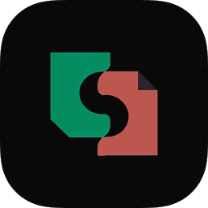

<p align="center">
  
</p>

<h1 align="center">svedocs</h1>

<p align="center">
  <strong>A SvelteKit-native documentation framework for edge-first docs.</strong>
</p>

<p align="center">
  <a href="https://github.com/backrunner/svedocs/blob/main/LICENSE"></a>
  
  
  
</p>

> svedocs is under active development. The first stable release has not shipped yet, so package APIs, templates, docs, and deployment defaults may still change before launch.

svedocs brings the moving parts of a modern docs site into one compact framework package: content discovery, Svelte-compatible Markdown rendering, navigation, search, Ask AI, SEO, sitemap and RSS generation, Open Graph images, Cloudflare helpers, and a polished default theme.

It is built for teams that want documentation to feel native to SvelteKit instead of bolted on through a separate renderer, theme package, search adapter graph, and deployment layer.

## Highlights

| Capability | What svedocs provides |
| --- | --- |
| Native SvelteKit docs | Markdown, `.svx`, and `.mdx`-style authoring compiled through the Svelte stack. |
| Unified content model | One manifest powers routes, sidebars, previous/next links, search records, SEO, sitemap and RSS entries, link checks, and OG routes. |
| Edge-first deployment | Cloudflare edge SSR is the default path, with static and SPA builds available when needed. |
| Search and Ask AI | Local MiniSearch for development, plus Algolia, Typesense, Cloudflare AI Search, Workers AI, and OpenAI-compatible providers. |
| Default theme | Tailwind CSS v4 theme with dark mode, command/search UI, Ask AI, ToC, locales, versions, code tools, and a pixel-style homepage. |
| Production CLI | Create projects, run dev/build/preview/check, generate search indexes and OG images, and deploy to Cloudflare Pages. |

## Quick Start

Until the first official release is published, the most reliable way to try svedocs is from this workspace:

```sh
pnpm install
pnpm --filter @svedocs/site dev
```

After packages are published, create a project with:

```sh
pnpm create svedocs my-docs
cd my-docs
pnpm dev
```

Template variants:

```sh
pnpm create svedocs my-docs --template minimal
pnpm create svedocs my-docs --template docs
pnpm create svedocs my-docs --template cloudflare
```

## Configuration

Projects are configured with `svedocs.config.ts`:

```ts
import { defineConfig } from 'svedocs/config';

export default defineConfig({
  site: {
    name: 'My docs',
    title: 'My docs',
    description: 'Documentation built with svedocs'
  },
  theme: {
    brand: {
      label: 'My docs',
      href: '/',
      logo: '/favicon.svg'
    }
  },
  search: {
    enabled: true,
    provider: 'local'
  },
  ai: false
});
```

The Vite plugin loads the config by default:

```ts
import { sveltekit } from '@sveltejs/kit/vite';
import { svedocs } from 'svedocs/vite';
import { defineConfig } from 'vite';

export default defineConfig({
  plugins: [svedocs(), sveltekit()]
});
```

## Content

svedocs reads docs and pages from configured content roots:

```txt
content/
  docs/
    index.md
    configuration.md
  pages/
    index.md
```

Frontmatter controls title, description, order, icon hints, locale, version, lifecycle status, and layout selection. The same parsed source drives rendering, navigation, search records, link checks, SEO metadata, sitemap and RSS entries, and Open Graph images.

## CLI

The CLI lives in `packages/cli` and ships both `svedocs` and `create-svedocs`:

```sh
svedocs create
svedocs dev
svedocs build --mode edge
svedocs build --mode static
svedocs build --mode spa
svedocs ssg
svedocs preview
svedocs check
svedocs index
svedocs og
svedocs deploy cloudflare
svedocs deploy cloudflare setup --write
```

Content-aware commands load `svedocs.config.*` first, then apply command-line overrides.

## Monorepo

This repository is intentionally compact:

| Path | Purpose |
| --- | --- |
| `packages/svedocs` | Integrated framework package: rendering, content, theme, Cloudflare, search, AI, SEO, and OG. |
| `packages/cli` | CLI implementation for `svedocs` and `create-svedocs`. |
| `packages/create-svedocs` | Thin package-manager compatibility shim that delegates to `svedocs-cli`. |
| `apps/site` | Private official site and live demo using the workspace `svedocs` package. |

Public imports stay small and stable:

```txt
svedocs/config
svedocs/core
svedocs/vite
svedocs/theme
svedocs/theme/styles.css
svedocs/cloudflare
svedocs/search
svedocs/ai
svedocs/og
svedocs/svelte
```

## Development

Common workspace commands:

```sh
pnpm install
pnpm build
pnpm check
pnpm test
pnpm lint
pnpm pack:dry-run
```

Focused validation:

```sh
pnpm --filter svedocs check
pnpm --filter svedocs test
pnpm --filter svedocs build

pnpm --filter svedocs-cli check
pnpm --filter svedocs-cli test
pnpm --filter svedocs-cli build

pnpm --filter @svedocs/site check
pnpm --filter @svedocs/site build
```

Before publishing packages, run:

```sh
pnpm release:check
```

Site deployments are manual operations. Authenticate Wrangler locally, validate the bundle, and deploy with:

```sh
pnpm deploy:site:dry-run
pnpm deploy:site
```

No GitHub workflow deploys the site. npm packages continue to publish through the manually dispatched `Release npm packages` workflow with trusted publishing and provenance.

Generated templates have a heavier install/build smoke test:

```sh
pnpm test:templates
```

## Release Status

svedocs is currently useful for local development, framework validation, demos, and early integration work. Treat npm publishing and compatibility work as release preparation until the official stable line is announced.

Publishable packages keep MIT license metadata, package `files` and `exports`, and provenance-enabled public publishing:

```json
{
  "publishConfig": {
    "access": "public",
    "provenance": true
  }
}
```
